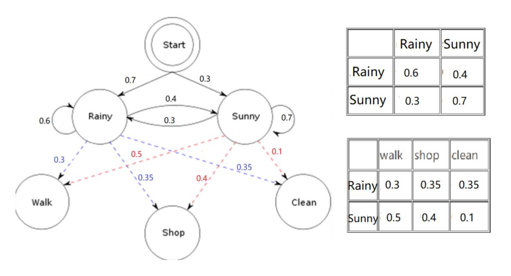

# HMM Decoding: Viterbi Algorithm

Implement the Viterbi algorithm and run it with the HMM in Figure 1 to compute the most likely weather sequence.

Figure 1. A Hidden Markov Model for relating action (Walk, Shop and Clean, the observations) to weather (Rainy or Sunny, the hidden variables). For this example, we are not using an end-state, instead allowing both states Rainy and Sunny to be a final (accepting) state.

## Implementation
1. The observation sequences (input sequence) could be any length from 1 to 10.
2. You can hard code the HMM in Figure 1 inside the program, but do not hard code the observation
sequence (input sequence).
3. Program from scratch, do not use any high-level package that already contains the algorithm.
4. Command Line: Python Viterbi.py <sequence>

## Packages
sys - Access system-specific parameters and functions.

## Execution

1. Go the directory where the python script is
2. Excute the follwoing command to run the program by command line

```
python3 Viterbi.py <sequence>
```

for example:
```
python3 Viterbi.py "WCWWSSCWC"
```

## Output

```
RRSSSSRRR
```

## Authors
* **Tzu-yi Kuo** - *Initial work* - [TYKuoTaiwan](https://github.com/TYKuoTaiwan)
